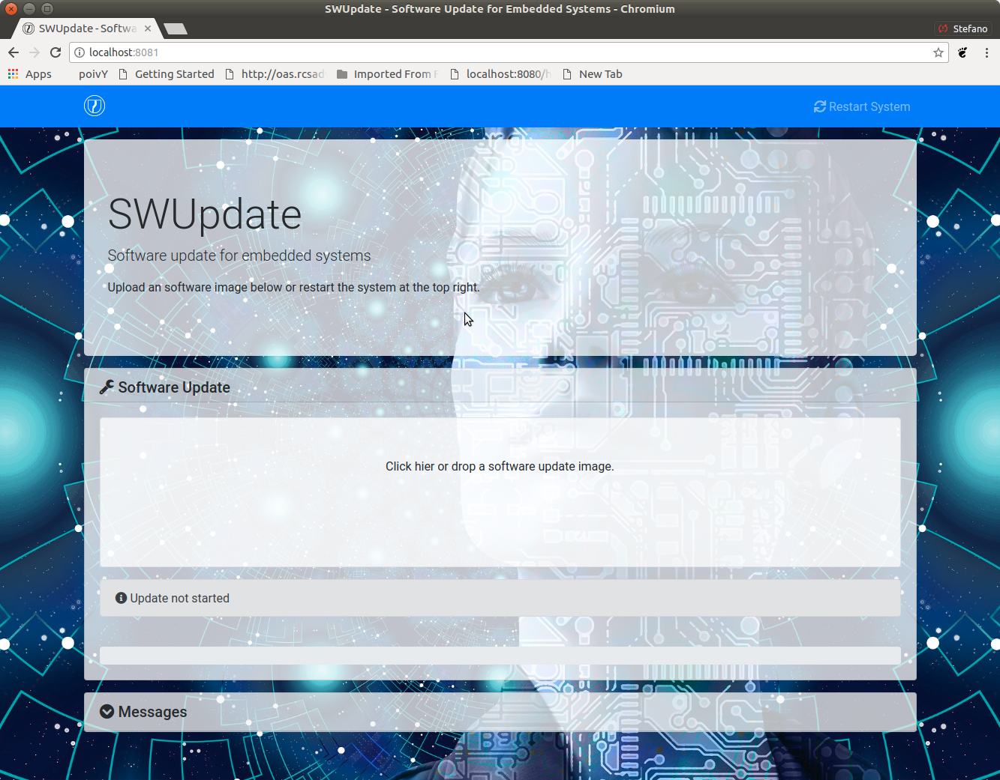
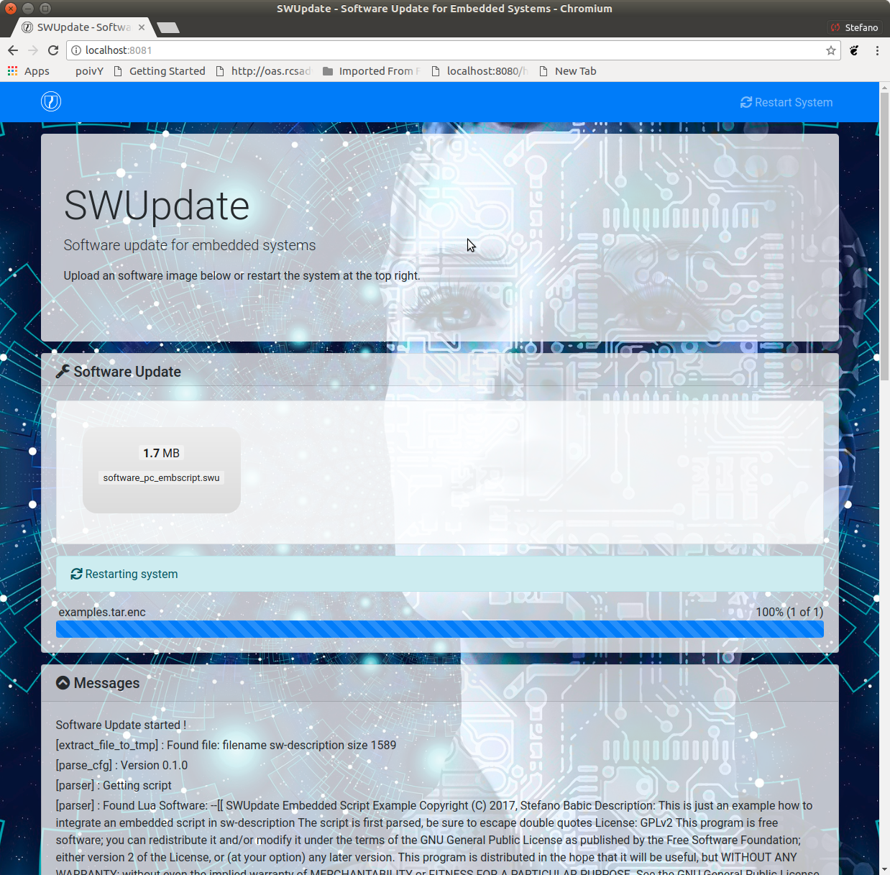

.. SPDX-FileCopyrightText: 2013-2021 Stefano Babic <sbabic@denx.de>
.. SPDX-License-Identifier: GPL-2.0-only

..
  =============================================
  SWUpdate: software update for embedded system
  =============================================
=============================================
SWUpdate: 組み込みシステムのためのソフトウェアアップデート
=============================================

..
  Overview
概要
========

..
  This project is thought to help to update an embedded
  system from a storage media or from network. However,
  it should be mainly considered as a framework, where
  further protocols or installers (in SWUpdate they are called handlers)
  can be easily added to the application.
このプロジェクトは、組み込みシステムをストレージ メディアまたはネットワークから更新するのに役立つと考えられています。
ただし、これは主に、追加のプロトコルまたはインストーラー (SWUpdate ではハンドラーと呼ばれます) をアプリケーションに簡単に追加できるフレームワークと見なす必要があります。

..
  One use case is to update from an external local media, as
  USB-Pen or SD-Card. In this case, the update is done
  without any intervention by an operator: it is thought
  as "one-key-update", and the software is started at reset
  simply pressing a key (or in any way that can be recognized
  by the target), making all checks automatically. At the end,
  the updating process reports only the status to the operator
  (successful or failed).
1 つの使用例は、USB ペンまたは SD カードなどの外部ローカル メディアから更新することです。
この場合、更新はオペレーターの介入なしで行われます。
これは「ワンキー更新」と見なされ、キーを押すだけで (またはターゲットが認識できる任意の方法で) ソフトウェアがリセット時に開始されます。 )、すべてのチェックを自動的に行います。
最後に、更新プロセスはステータス (成功または失敗) のみをオペレーターに報告します。 

..
  The output can be displayed on a LCD using the frame-buffer
  device or directed to a serial line (Linux console).
出力は、フレーム バッファ デバイスを使用して LCD に表示するか、シリアル ライン (Linux コンソール) に送信できます。

..
  It is generally used in the single copy approach, running in an initrd
  (recipes are provided to generate with Yocto).  However, it is
  possible to use it in a double-copy approach by use of :ref:`collections`.
これは通常、initrd で実行されるシングル コピー アプローチで使用されます (Yocto で生成するためのレシピが提供されます)。
ただし、 :ref:`collections` を使用することにより、二重コピー アプローチで使用することができます。

..
  If started for a remote update, SWUpdate starts an embedded
  Web-server and waits for requests. The operator must upload
  a suitable image, that SWUpdate checks and then install.
  All output is notified to the operator's browser via AJAX
  notifications.
リモート更新のために開始された場合、SWUpdate は組み込み Web サーバーを開始し、要求を待ちます。
オペレーターは、適切なイメージをアップロードする必要があります。
このイメージは、SWUpdate によってチェックされ、インストールされます。
すべての出力は、AJAX 通知を介してオペレーターのブラウザーに通知されます。

..
  Features
特長
========

..
  General Overview
概要
----------------

..
  - Install on embedded Media (eMMC, SD, Raw NAND,
    NOR and SPI-NOR flashes)
- 組み込みメディア (eMMC、SD、Raw NAND、NOR、SPI-NOR フラッシュ) にインストール

..
  - check if an image is available. The image is built
    in a specified format (cpio) and it must contain
    a file describing the software that must be updated.
- イメージが利用可能かどうかを確認します。
  イメージは指定された形式 (cpio) で構築され、更新する必要があるソフトウェアを記述したファイルが含まれている必要があります。 

..
  - SWUpdate is thought to update UBI volumes (mainly for NAND, but not only)
    and images on devices. Passing a whole image can still be updated
    as a partition on the SD card, or a MTD partition.
- SWUpdate は、UBI ボリューム (主に NAND 用ですが、それだけではありません) とデバイス上のイメージを更新すると考えられています。
  イメージ全体を渡すと、SD カードのパーティションまたは MTD パーティションとして更新できます。

..
  - new partition schema. This is bound with UBI volume.
    SWUpdate can recreate UBI volumes, resizing them and
    copying the new software.
- 新しいパーティション スキーマ。
  これは UBI ボリュームにバインドされています。
  SWUpdate は、UBI ボリュームを再作成し、サイズを変更して、新しいソフトウェアをコピーできます。

..
  - support for compressed images, using the zlib and zstd library.
    tarball (tgz file) are supported.
- zlib および zstd ライブラリを使用した圧縮イメージのサポート。
 tarball (tgz ファイル) がサポートされています。 

..
  - support for partitioned USB-pen or unpartitioned (mainly
    used by Windows).
- パーティション化された USB ペンまたはパーティション化されていない (主に Windows で使用される) のサポート。

..
  - support for updating a single file inside a filesystem.
    The filesystem where to put the file must be described.
- ファイルシステム内の単一ファイルの更新のサポート。
  ファイルを配置するファイルシステムを記述する必要があります。 

..
  - checksum for the single components of an image
- イメージの単一コンポーネントのチェックサム

- use a structured language to describe the image. This is done
  using the libconfig_ library as default parser, that uses a
  JSON-like description.

- use custom's choice for the description of the image. It is
  possible to write an own parser using the Lua language.
  An example using a XML description in Lua is provided
  in the examples directory.

- Support for setting / erasing U-Boot variables

- Support for setting / erasing `GRUB`_ environment block variables

- Support for setting / erasing `EFI Boot Guard`_ variables

- Support for pre and post update commands run before the update starts
  processing data and after the update has finished successfully.

- Support for lua hooks, executed before any handler runs.

- Support for preinstall scripts. They run after streamed handlers have
  handled their data, and before regular handlers.

- Support for postinstall scripts. They run after updating the images.

- Network installer using an embedded Web-server (Mongoose Server
  was chosen, in the version under Lua license). A different
  Web-server can be used.

- Multiple interfaces for getting software
       - local Storage: USB, SD, UART,..
- OTA / Remote
       - integrated Web-Server
       - pulling from remote Server (HTTP, HTTPS, ..)
       - using a Backend. SWUpdate is open to talk with back end
         servers for rolling out software updates.
         Current version supports the hawkBit server, but other
         backend can be added.

- Can be configured to check for compatibility between software and hardware
  revisions. The software image must contain an entry declaring on which
  HW revision the software is allowed to run.
  SWUpdate refuses to install if the compatibility is not verified.

- support for image extraction. A manufacturer can require to have
  a single image that contains the software for more as one device.
  This simplifies the manufacturer's management and reduces
  their administrative costs having a single software product.
  SWUpdate receives the software as stream without temporary storing,
  and extracts only the required components for the device
  to be installed.

- allow custom handlers for installing FPGA firmware,
  micro-controller firmware via custom protocols.

- Features are enabled / disabled using "make menuconfig".
  (Kbuild is inherited from busybox project)

- Images are authenticated and verified before installing

- Power-Off safe

.. _libconfig: http://www.hyperrealm.com/libconfig/
.. _GRUB: https://www.gnu.org/software/grub/manual/html_node/Environment-block.html
.. _EFI Boot Guard: https://github.com/siemens/efibootguard

..
  Single image delivery
単一イメージの配信
---------------------

..
  The main concept is that the manufacturer delivers a single
  big image. All single images are packed together (cpio was chosen
  for its simplicity and because can be streamed) together with
  an additional file (sw-description), that contains meta
  information about each single image.
主なコンセプトは、メーカーが 1 つの大きなイメージを提供することです。
すべての単一イメージは、各単一イメージに関するメタ情報を含む追加のファイル (sw-description) と一緒にパックされます (cpio は、その単純さとストリーミング可能性のために選択されました)。 

..
  The format of sw-description can be customized: SWUpdate can be
  configured to use its internal parser (based on libconfig), or calling
  an external parser in Lua.
sw-description の形式はカスタマイズできます。
SWUpdate は、内部パーサー (libconfig に基づく) を使用するか、Lua で外部パーサーを呼び出すように構成できます。

..
  Changing the rules to accept images with an external parser,
  let to extend to new image types and how they are installed.
  In fact, the scope of the parser is to retrieve which single
  images must be installed and how.
  SWUpdate implements "handlers" to install a single image:
  there are handlers to install images into UBI volumes,
  or to a SD card, a CFI Flash, and so on. It is then easy to
  add an own handler if a very special installer is required.
外部パーサーでイメージを受け入れるようにルールを変更し、新しいイメージ タイプとそのインストール方法に拡張します。
実際、パーサーの範囲は、どの単一イメージをどのようにインストールする必要があるかを取得することです。
SWUpdate は、単一のイメージをインストールするための「ハンドラ」を実装しています。
UBI ボリューム、SD カード、CFI フラッシュなどにイメージをインストールするためのハンドラがあります。
非常に特別なインストーラーが必要な場合は、独自のハンドラーを簡単に追加できます。

For example we can think at a project with a main processor and
one or several micro-controllers. Let's say for simplicity that
the main processor communicates with the micro-controllers via
UARTS using a proprietary protocol. The software on the micro-controllers
can be updated using the proprietary protocol.

It is possible to extend SWUpdate writing a handler, that implements
the part of the proprietary protocol to perform the upgrade
on the micro-controller. The parser must recognize which image must be
installed with the new handler, and SWUpdate will call the handler
during the installation process.

..
  Streaming feature
ストリーミング機能
-----------------

..
  SWUpdate is thought to be able to stream the received image directly into
  the target, without any temporary copy. In fact, the single installer
  (handler) receive as input the file descriptor set at the beginning of
  the image that must be installed.
SWUpdate は、一時的なコピーなしで、受信したイメージをターゲットに直接ストリーミングできると考えられています。
実際、単一のインストーラー (ハンドラー) は、インストールする必要があるイメージの先頭に設定されたファイル記述子を入力として受け取ります。

The feature can be set on image basis, that means that a user can
decide which partial images should be streamed. If not streamed (see
installed-directly flag), files are temporary extracted into the directory
pointed to by the environment variable ``TMPDIR`` with ``/tmp`` as
fall-back if ``TMPDIR`` is not set.
Of course, by streaming it is not possible to make checks on the whole delivered
software before installing.
The temporary copy is done only when updated from network. When the image
is stored on an external storage, there is no need of that copy.

Images fully streamed
---------------------

In case of remote update, SWUpdate extracts relevant images from the stream
and copies them into the directory pointed to by the environment variable
``TMPDIR`` (if unset, to ``/tmp``) before calling the handlers.
This guarantee that an update is initiated only if all parts are present and
correct. However, on some systems with less resources, the amount of RAM
to copy the images could be not enough, for example if the filesystem on
an attached SD Card must be updated. In this case, it will help if the images
are installed directly as stream by the corresponding handler, without temporary
copies. Not all handlers support to stream directly into the target.
Streaming with zero-copy is enabled by setting the flag "installed-directly"
in the description of the single image.

..
  Configuration and build
設定とビルド
=======================

..
  Requirements
要件
------------

..
  There are only a few libraries that are required to compile SWUpdate.
SWUpdate のコンパイルに必要なライブラリはわずかです。

- mtd-utils: internally, mtd-utils generates libmtd and libubi.
  They are commonly not exported and not installed, but they are
  linked by SWUpdate to reuse the same functions for upgrading
  MTD and UBI volumes.
- openssl / wolfssl / mbedtls (optional) for cryptographic operations
- p11-kit & wolfssl (optional) for PKCS#11 support
- Lua: liblua and the development headers.
- libz is always linked.
- libconfig (optional) for the default parser
- libarchive (optional) for archive handler
- librsync (optional) for support to apply rdiff patches
- libjson (optional) for JSON parser and hawkBit
- libubootenv (optional) if support for U-Boot is enabled
- libebgenv (optional) if support for EFI Boot Guard is enabled
- libcurl used to communicate with network

New handlers can add some other libraries to the requirement list -
check if you need all handlers in case you get build errors,
and drop what you do not need.

..
  Building with Yocto
Yocto でビルド
-------------------

..
  See corresponding chapter how to build in Yocto.
Yocto でビルドする方法については、対応する章を参照してください。 

..
  Configuring SWUpdate
SWUpdateの設定
--------------------

..
  SWUpdate is configurable via "make menuconfig". The small footprint
  is reached using the internal parser and disabling the web server.
  Any option has a small help describing its usage. In the default
  configuration, many options are already activated.
SWUpdate は "make menuconfig" で設定できます。
内部パーサーを使用し、Web サーバーを無効にすることで、小さなフットプリントに到達します。
どのオプションにも、その使用法を説明する小さなヘルプがあります。
デフォルト設定では、多くのオプションがすでに有効になっています。

..
  To configure the options:
オプションを設定するには:

::

	make menuconfig

Building
--------

- to cross-compile, set the CC and CXX variables before running make.
  It is also possible to set the cross-compiler prefix as option with
  make menuconfig.
- generate the code

::

	make

The result is the binary "swupdate". A second binary "progress" is built,
but it is not strictly required. It is an example how to build your
own interface to SWUpdate to show a progress bar or whatever you want on your
HMI. The example simply prints on the console the current status of the update.

In the Yocto buildsystem,:

::

        bitbake swupdate

This will build the package

::

        bitbake swupdate-image

This builds a rescue image. The result is a Ramdisk that
can be loaded directly by the bootloader.
To use SWUpdate in the double-copy mode, put the package
swupdate into your rootfs. Check your image recipe, and
simply add it to the list of the installed packages.

For example, if we want to add it to the standard "core-image-full-cmdline"
image, we can add a *recipes-extended/images/core-image-full-cmdline.bbappend*

::

        IMAGE_INSTALL += " \
                                swupdate \
                                swupdate-www \
                         "

swupdate-www is the package with the website, that you can customize with
your own logo, template ans style.

Building a debian package
-------------------------

SWUpdate is thought for Embedded Systems and building in an embedded
distribution is the first use case. But apart the most used buildsystems
for embedded as Yocto or Buildroot, in some cases a standard Linux distro
is used. Not only, a distro package allows one to run SWUpdate on Linux PC
for test purposes without having to fight with dependencies. Using the
debhelper tools, it is possible to generate a debian package.

Steps for building a debian package
...................................

::

        ./debian/rules clean
        ./debian/rules build
        fakeroot debian/rules binary

The result is a "deb" package stored in the parent directory.

Alternative way signing source package
......................................

You can use dpkg-buildpackage:

::

        dpkg-buildpackage -us -uc
        debsign -k <keyId>

..
  Running SWUpdate
SWUpdateの実行
================

..
  What is expected from a SWUpdate run
SWUpdate の実行に期待されること
------------------------------------

..
  The whole update process can be seen as a set of pipelines. The incoming stream
  (the SWU file) is processed by each pipe and passed to the next step.
  First, the SWU is streamed from one of the interfaces : local (USB, filesystem), Webserver,
  suricatta (one of the backend), etc. The incoming SWU is forwarded to the installer to be examined
  and installed.
  A run of SWUpdate consists mainly of the following steps:
更新プロセス全体は、一連のパイプラインと見なすことができます。
入力ストリーム (SWU ファイル) は、各パイプによって処理され、次のステップに渡されます。
最初に、ローカル (USB、ファイルシステム)、Web サーバー、suricatta (バックエンドの 1 つ) などのインターフェイスの 1 つから SWU がストリーミングされます。
受信した SWU はインストーラーに転送され、検査およびインストールされます。
SWUpdate の実行は、主に次の手順で構成されます。

..
  - extracts sw-description from the stream and verifies it
    It parses sw-description creating a raw description in RAM
    about the activities that must be performed.
  - if Signed Images is activated, extracts sw-description.sig and
    validate sw-description.
  - check for hardware-software compatibility, if any,
    reading hardware revision from hardware and matching
    with the table in sw-description.
  - Parse sw-description to determine which artefacts in the incoming SWU
    are required. Not required artifacts are simply skipped.
    If an "embedded-script" is defined, it is executed at this point
    before parsing files.
    If "hooks" are defined, they are executed as each file is parsed,
    even if they will be skipped.
    At the end of the parsing, SWUpdate builds an internal mapping for each artifact
    to recognize which handler should be called for each of them.
  - runs the pre update command, if set
  - runs partition handlers, if required.
  - reads through the cpio archive one file at a time and either:
          * execute handlers for each file marked as "installed-directly".
            checksum is checked while the data is streamed to handler, and copy will
            be marked as having failed if checksum was not correct failing the rest
            of the install.
          * copy other files to a temporary location while checking checksums,
            stopping if there was a mismatch.
  - iterates through all `scripts` and call the corresponding
    handler for pre-install scripts.
    Please note: if artifacts are streamed, they will be extracted
    before this runs. If earlier execution is required, please use
    the "embedded-script" or hooks features to ensure code is run
    before installation takes place.
  - iterates through all `images` and call the corresponding
    handler for installing on target.
  - iterates through all `files` and call the corresponding
    handler for installing on target.
  - iterates through all `scripts` and call the corresponding
    handler for post-install scripts
  - iterates through all `bootenv` and updates the bootloader environment.
  - reports the status to the operator through the notification interface
    (logging, traces) and through the progress interface.
  - runs the post update command, if set.
- ストリームから sw-description を抽出し、それを検証します。
  sw-description を解析して、実行する必要があるアクティビティに関する未加工の説明を RAM に作成します。
- 署名付きイメージが有効になっている場合、sw-description.sig を抽出し、sw-description を検証します。 
- ハードウェアとソフトウェアの互換性がある場合は、ハードウェアからハードウェア リビジョンを読み取り、sw-description のテーブルと一致するかどうかを確認します。
- Parse sw-description to determine which artefacts in the incoming SWU
  are required. Not required artifacts are simply skipped.
  If an "embedded-script" is defined, it is executed at this point
  before parsing files.
  If "hooks" are defined, they are executed as each file is parsed,
  even if they will be skipped.
  At the end of the parsing, SWUpdate builds an internal mapping for each artifact
  to recognize which handler should be called for each of them.
- runs the pre update command, if set
- runs partition handlers, if required.
- reads through the cpio archive one file at a time and either:
        * execute handlers for each file marked as "installed-directly".
          checksum is checked while the data is streamed to handler, and copy will
          be marked as having failed if checksum was not correct failing the rest
          of the install.
        * copy other files to a temporary location while checking checksums,
          stopping if there was a mismatch.
- iterates through all `scripts` and call the corresponding
  handler for pre-install scripts.
  Please note: if artifacts are streamed, they will be extracted
  before this runs. If earlier execution is required, please use
  the "embedded-script" or hooks features to ensure code is run
  before installation takes place.
- iterates through all `images` and call the corresponding
  handler for installing on target.
- iterates through all `files` and call the corresponding
  handler for installing on target.
- iterates through all `scripts` and call the corresponding
  handler for post-install scripts
- iterates through all `bootenv` and updates the bootloader environment.
- reports the status to the operator through the notification interface
  (logging, traces) and through the progress interface.
- runs the post update command, if set.

..
  The first step that fails, stops the entire procedure and
  an error is reported.
最初のステップが失敗すると、手順全体が停止し、エラーが報告されます。

..
  To start SWUpdate expecting the image from a file:
ファイルからのイメージを期待して SWUpdate を開始するには:

::

	        swupdate -i <filename>

To start with the embedded web server:

::

	         swupdate -w "<web server options>"

The main important parameters for the web server are "document-root" and "port".

::

	         swupdate -w "--document-root ./www --port 8080"

The embedded web server is taken from the Mongoose project.

The list of available options (depending on activated features) is shown with:

::

        swupdate -h

This uses as website the pages delivered with the code. Of course,
they can be customized and replaced. The website uses AJAX to communicate
with SWUpdate, and to show the progress of the update to the operator.

The default port of the Web-server is 8080. You can then connect to the target
with:

::

	http://<target_ip>:8080

If it works, the start page should be displayed as in next figure.

If a correct image is downloaded, SWUpdate starts to process the received image.
All notifications are sent back to the browser. SWUpdate provides a mechanism
to send to a receiver the progress of the installation. In fact, SWUpdate
takes a list of objects that registers itself with the application
and they will be informed any time the application calls the notify() function.
This allows also for self-written handlers to inform the upper layers about
error conditions or simply return the status. It is then simply to add
own receivers to implement customized way to display the results: displaying
on a LCD (if the target has one), or sending back to another device via
network.
An example of the notifications sent back to the browser is in the next figure:

Software collections can be specified by passing `--select` command
line option. Assuming `sw-description` file contains a collection
named `stable`, with `alt` installation location, `SWUpdate` can be
called like this::

   swupdate --select stable,alt

Command line parameters
-----------------------

+-------------+----------+--------------------------------------------+
|  Parameter  | Type     | Description                                |
+=============+==========+============================================+
| -f <file>   | string   | SWUpdate configuration file to use.        |
|             |          | See ``examples/configuration/swupdate.cfg``|
|             |          | in the source code for details.            |
+-------------+----------+--------------------------------------------+
| -b <string> | string   | Available if CONFIG_UBIATTACH is set.      |
|             |          | It allows one to blacklist MTDs when       |
|             |          | SWUpdate searches for UBI volumes.         |
|             |          | Example: U-Boot and environment in MTD0-1: |
|             |          | ``swupdate -b "0 1"``.                     |
+-------------+----------+--------------------------------------------+
| -B <loader> | string   | Override the default bootloader interface  |
|             |          | to use ``loader`` instead.                 |
+-------------+----------+--------------------------------------------+
| -e <sel>    | string   | ``sel`` is in the format <software>,<mode>.|
|             |          | It allows one to find a subset of rules in |
|             |          | the sw-description file. With it,          |
|             |          | multiple rules are allowed.                |
|             |          | One common usage is in case of the dual    |
|             |          | copy approach. Example:                    |
|             |          | -e "stable, copy1"  ==> install on copy1   |
|             |          | -e "stable, copy2"  ==> install on copy2   |
+-------------+----------+--------------------------------------------+
| --excluded  | string   | ``sel`` is in the format <software>,<mode>.|
|  <sel>      |          | It sets a blacklist of selections that     |
|             |          | cannot be used for an update.              |
|             |          | Selections can be activated not only with  |
|             |          | -e, but also via IPC.                      |
|             |          | Multiple --excluded are allowed            |
+-------------+----------+--------------------------------------------+
| -h          |    -     | Run usage with help.                       |
+-------------+----------+--------------------------------------------+
| -k <file>   | string   | Available if CONFIG_SIGNED is set.         |
|             |          | Filename with the public key.              |
+-------------+----------+--------------------------------------------+
| -K <file>   | string   | Available on CONFIG_ENCRYPTED_IMAGES set.  |
|             |          | Filename with the symmetric key to be used |
|             |          | for decryption.                            |
+-------------+----------+--------------------------------------------+
| --cert-\    | string   | Available if CONFIG_SIGNED_IMAGES is set.  |
| purpose     |          | Set expected certificate purpose.          |
| <purpose>   |          |                                            |
+-------------+----------+--------------------------------------------+
| --forced-\  | string   | Available if CONFIG_SIGNED_IMAGES is set.  |
| signer-\    |          | Set expected common name of signer         |
| name <cn>   |          | certificate.                               |
+-------------+----------+--------------------------------------------+
| --ca-\      | string   | Available if CONFIG_SIGNED_IMAGES is set.  |
| path <file> |          | Path to the Certificate Authority (PEM).   |
+-------------+----------+--------------------------------------------+
| --get-root  |          | Detect and print the root device and exit  |
+-------------+----------+--------------------------------------------+
| -l <level>  | int      | Set loglevel.                              |
+-------------+----------+--------------------------------------------+
| -L          |    -     | Send LOG output to syslog (local).         |
+-------------+----------+--------------------------------------------+
| -i <file>   | string   | Run SWUpdate with a local .swu file.       |
+-------------+----------+--------------------------------------------+
| -n          |    -     | Run SWUpdate in dry-run mode.              |
+-------------+----------+--------------------------------------------+
| -N <version>| string   | The minimum required version of software.  |
|             |          | This will be checked with the version of   |
|             |          | new software and forbids downgrading.      |
|             |          | Version consists of either 4 numbers       |
|             |          | (major.minor.rev.build with each field in  |
|             |          | the range 0..65535) or it is a semantic    |
|             |          | version.                                   |
+-------------+----------+--------------------------------------------+
| -max-version| string   | The maximum required version of software.  |
|   <version> |          | This will be checked with the version of   |
|             |          | new software.                              |
|             |          | Version consists of either 4 numbers       |
|             |          | (major.minor.rev.build with each field in  |
|             |          | the range 0..65535) or it is a semantic    |
|             |          | version.                                   |
+-------------+----------+--------------------------------------------+
| -R <version>| string   | The current installed version of software. |
|             |          | This will be checked with the version of   |
|             |          | new software and forbids reinstalling.     |
+-------------+----------+--------------------------------------------+
| -o <file>   | string   | Save the stream (SWU) to a file.           |
+-------------+----------+--------------------------------------------+
| -v          |    -     | Activate verbose output.                   |
+-------------+----------+--------------------------------------------+
| -M          |    -     | Disable setting the bootloader transaction |
|             |          | marker.                                    |
+-------------+----------+--------------------------------------------+
| -m          |    -     | Disable setting the update state in the    |
|             |          | bootloader.                                |
+-------------+----------+--------------------------------------------+
| -w <parms>  | string   | Available if CONFIG_WEBSERVER is set.      |
|             |          | Start internal webserver and pass to it    |
|             |          | a command line string.                     |
+-------------+----------+--------------------------------------------+
| -d <parms>  | string   | Available if CONFIG_DOWNLOAD is set.       |
|             |          | Start internal downloader client and pass  |
|             |          | to it a command line string.               |
|             |          | See below the internal command line        |
|             |          | arguments for the downloader.              |
+-------------+----------+--------------------------------------------+
| -u <parms>  | string   | Available if CONFIG_SURICATTA is set.      |
|             |          | Start internal suricatta client daemon and |
|             |          | pass to it a command line string.          |
|             |          | See below the internal command line        |
|             |          | arguments for suricatta.                   |
+-------------+----------+--------------------------------------------+
| -H          | string   | Available on CONFIG_HW_COMPATIBILITY set.  |
| <board:rev> |          | Set board name and hardware revision.      |
+-------------+----------+--------------------------------------------+
| -c          |    -     | Check ``*.swu`` file. It ensures that files|
|             |          | referenced in sw-description are present.  |
|             |          | Usage: ``swupdate -c -i <file>``           |
+-------------+----------+--------------------------------------------+
| -P <cmd>    | string   | Execute pre-update command.                |
+-------------+----------+--------------------------------------------+
| -p <cmd>    | string   | Execute post-update command.               |
+-------------+----------+--------------------------------------------+

Downloader command line parameters
..................................

Example: ``swupdate -d "-u example.com"``

Mandatory arguments are marked with '\*':

+-------------+----------+--------------------------------------------+
|  Parameter  | Type     | Description                                |
+=============+==========+============================================+
| -u <url>    | string   | \* This is the URL where new software is   |
|             |          | pulled. URL is a link to a valid .swu image|
+-------------+----------+--------------------------------------------+
| -r <retries>| integer  | Number of retries before a download is     |
|             |          | considered broken. With "-r 0", SWUpdate   |
|             |          | will not stop until a valid software is    |
|             |          | loaded.                                    |
+-------------+----------+--------------------------------------------+
| -t <timeout>| integer  | Timeout for connection lost                |
|             |          | downloader or Webserver                    |
+-------------+----------+--------------------------------------------+
| -a <usr:pwd>| string   | Send user and password for Basic Auth      |
+-------------+----------+--------------------------------------------+

Suricatta command line parameters
.................................

Example: ``swupdate -u "-t default -u localhost:8080 -i 1B7"``

Note that different suricatta modules may have different parameters.
The below listed options are for SWUpdate's hawkBit support.

Mandatory arguments are marked with '\*':

+-------------------------+----------+--------------------------------------------+
|  Parameter              | Type     | Description                                |
+=========================+==========+============================================+
| -t <tenant>             | string   | \* Set hawkBit tenant ID for this device.  |
+-------------------------+----------+--------------------------------------------+
| -u <url>                | string   | \* Host and port of the hawkBit instance,  |
|                         |          | e.g., localhost:8080                       |
+-------------------------+----------+--------------------------------------------+
| -i <id>                 | integer  | \* The device ID to communicate to hawkBit.|
+-------------------------+----------+--------------------------------------------+
| -c <confirm>            | integer  | Confirm update status to server: 1=AGAIN,  |
|                         |          | 2=SUCCESS, 3=FAILED                        |
+-------------------------+----------+--------------------------------------------+
| -x                      | -        | Do not abort on flawed server certificates.|
+-------------------------+----------+--------------------------------------------+
| -p <polldelay>          | integer  | Delay in seconds between two hawkBit poll  |
|                         |          | operations (default: 45s).                 |
+-------------------------+----------+--------------------------------------------+
| -r <retry>              | integer  | Resume and retry interrupted downloads     |
|                         |          | (default: 5 tries).                        |
+-------------------------+----------+--------------------------------------------+
| -w <retrywait>          | integer  | Time to wait prior to retry and resume a   |
|                         |          | download (default: 5s).                    |
+-------------------------+----------+--------------------------------------------+
| -y <proxy>              | string   | Use proxy. Either give proxy URL,          |
|                         |          | else {http,all}_proxy env is tried.        |
+-------------------------+----------+--------------------------------------------+
| -k <targettoken>        | string   | Set target token.                          |
+-------------------------+----------+--------------------------------------------+
| -g <gatewaytoken>       | string   | Set gateway token.                         |
+-------------------------+----------+--------------------------------------------+
| -f <interface>          | string   | Set the network interface to connect to    |
|                         |          | hawkBit.                                   |
+-------------------------+----------+--------------------------------------------+
| -e                      | -        | Daemon enabled at startup (default).       |
+-------------------------+----------+--------------------------------------------+
| -d                      | -        | Daemon disabled at startup.                |
+-------------------------+----------+--------------------------------------------+
| --disable-token-for-dwl | -        | Do not send authentication header when     |
|                         |          | downloading SWU.                           |
+-------------------------+----------+--------------------------------------------+
| --cache-file            | string   | This allows one to resume an update after a|
|                         |          | power cut. If the SWU is saved in a file,  |
|                         |          | SWUpdate can reuse the file and download   |
|                         |          | just the remaining part of the SWU.        |
+-------------------------+----------+--------------------------------------------+
| -m <seconds>            | integer  | Delay in seconds between re-trying to send |
|                         |          | initial feedback specified with "-c"       |
|                         |          | option. Default value is 10 seconds. If    |
|                         |          | Suricatta is started with initial state of |
|                         |          | STATE_WAIT ("-c 6"), this value is ignored.|
+-------------------------+----------+--------------------------------------------+
| -s <seconds>            | integer  | Connection timeout to use in seconds.      |
|                         |          | If user doesn't set this option, default   |
|                         |          | libcurl connection timeout value of 300    |
|                         |          | seconds is used.                           |
|                         |          | NOTE: it is not possible for Suricatta to  |
|                         |          | respond to external program API requests   |
|                         |          | during this period - adapt this value to   |
|                         |          | your use case!                             |
+-------------------------+----------+--------------------------------------------+
| -a <name> <value>       | strings  | Custom HTTP header with given name and     |
|                         |          | value to be sent with every HTTP request   |
|                         |          | made.                                      |
+-------------------------+----------+--------------------------------------------+
| -n <value>              | string   | Maximum download speed to be used.         |
|                         |          | Value be specified in kB/s, B/s, MB/s      |
|                         |          | or GB/s. Examples:                         |
|                         |          | -n 100k : Set limit to 100 kB/s.           |
|                         |          | -n 500  : Set limit to 500 B/s.            |
|                         |          | -n 2M   : Set limit to 1 M/s.              |
|                         |          | -n 1G   : Set limit to 1 G/s.              |
+-------------------------+----------+--------------------------------------------+

Webserver command line parameters
.................................

Example: ``swupdate -w "-r /www -p 8080"``

Mandatory arguments are marked with '\*':

+-------------------------+----------+--------------------------------------------+
|  Parameter              | Type     | Description                                |
+=========================+==========+============================================+
| -r <document root>      | string   | \* Path where the web app is stored.       |
+-------------------------+----------+--------------------------------------------+
| -p <port>               | integer  | \* TCP port to be listened                 |
|                         |          | if not set, 8080 is used                   |
+-------------------------+----------+--------------------------------------------+
| -s <ssl>                |          | \* Enable SSL support. Note: it must be    |
|                         |          | configured with CONFIG_MONGOOSESSL         |
+-------------------------+----------+--------------------------------------------+
| --ssl-cert <cert>       | string   | Path to the certificate to present to      |
|                         |          | clients                                    |
+-------------------------+----------+--------------------------------------------+
| -K <key>                | string   | Path to key corresponding to ssl           |
|                         |          | certificate                                |
+-------------------------+----------+--------------------------------------------+
| -t <timeout>            | integer  | Timeout to consider a connection lost if   |
|                         |          | clients stops to send data. If hit, an     |
|                         |          | update is aborted. Default=0 (unlimited)   |
+-------------------------+----------+--------------------------------------------+
| --auth-domain <string>  | string   | Set authentication domain                  |
|                         |          | Default: none                              |
+-------------------------+----------+--------------------------------------------+
| --global-auth-file      | string   | Set authentication file if any             |
|  <string>               |          | Default: none                              |
+-------------------------+----------+--------------------------------------------+

..
  systemd Integration
systemd統合
-------------------

..
  SWUpdate has optional systemd_ support via the compile-time
  configuration switch ``CONFIG_SYSTEMD``. If enabled, SWUpdate
  signals systemd about start-up completion and can make optional
  use of systemd's socket-based activation feature.
SWUpdate には、コンパイル時の構成スイッチ ``CONFIG_SYSTEMD`` によるオプションの systemd_ サポートがあります。
有効にすると、SWUpdate は systemd に起動完了を通知し、systemd のソケットベースのアクティベーション機能をオプションで使用できます。

..
  A sample systemd service unit file ``/etc/systemd/system/swupdate.service``
  may look like the following starting SWUpdate in suricatta daemon mode:
サンプルの systemd サービス ユニット ファイル ``/etc/systemd/system/swupdate.service`` は、suricatta デーモン モードで SWUpdate を開始する次のようになります。

::

	[Unit]
	Description=SWUpdate daemon
	Documentation=https://github.com/sbabic/swupdate
	Documentation=https://sbabic.github.io/swupdate

	[Service]
	Type=notify
	ExecStart=/usr/bin/swupdate -u '-t default -u http://localhost -i 25'

	[Install]
	WantedBy=multi-user.target

Started via ``systemctl start swupdate.service``, SWUpdate
(re)creates its sockets on startup. For using socket-based
activation, an accompanying systemd socket unit file
``/etc/systemd/system/swupdate.socket`` is required:

::

	[Unit]
	Description=SWUpdate socket listener
	Documentation=https://github.com/sbabic/swupdate
	Documentation=https://sbabic.github.io/swupdate

	[Socket]
	ListenStream=/tmp/sockinstctrl
	ListenStream=/tmp/swupdateprog

	[Install]
	WantedBy=sockets.target

On ``swupdate.socket`` being started, systemd creates the socket
files and hands them over to SWUpdate when it starts. So, for
example, when talking to ``/tmp/swupdateprog``, systemd starts
``swupdate.service`` and hands-over the socket files. The socket
files are also handed over on a "regular" start of SWUpdate via
``systemctl start swupdate.service``.

Note that the socket paths in the two ``ListenStream=`` directives
have to match the socket paths ``CONFIG_SOCKET_CTRL_PATH`` and
``CONFIG_SOCKET_PROGRESS_PATH`` in SWUpdate's configuration.
Here, the default socket path configuration is depicted.

.. _systemd: https://www.freedesktop.org/wiki/Software/systemd/

..
  Changes in boot-loader code
ブートローダーコードの変更
===========================

..
  The SWUpdate consists of kernel and a root filesystem
  (image) that must be started by the boot-loader.
  In case using U-Boot, the following mechanism can be implemented:
SWUpdate は、ブートローダーによって開始される必要があるカーネルとルート ファイルシステム (イメージ) で構成されます。
U-Boot を使用する場合、次のメカニズムを実装できます。

..
  - U-Boot checks if a sw update is required (check gpio, serial console, etc.).
  - the script "altbootcmd" sets the rules to start SWUpdate
  - in case SWUpdate is required, U-boot run the script "altbootcmd"
- U-Boot は、sw の更新が必要かどうかを確認します (gpio、シリアル コンソールなどを確認します)。 
- スクリプト "altbootcmd" は、SWUpdate を開始するためのルールを設定します
- SWUpdate が必要な場合は、U-Boot でスクリプト "altbootcmd" を実行します。

..
  Is it safe to change U-Boot environment ? Well, it is, but U-Boot must
  be configured correctly. U-Boot supports two copies of the environment
  to be power-off safe during an environment update. The board's
  configuration file must have defined CONFIG_ENV_OFFSET_REDUND or
  CONFIG_ENV_ADDR_REDUND. Check in U-Boot documentation for these
  constants and how to use them.
U-Boot 環境を変更しても安全ですか?
その通りですが、U-Boot を正しく構成する必要があります。
U-Boot は、環境の更新中に電源を切っても安全な環境の 2 つのコピーをサポートします。
ボードの構成ファイルには、CONFIG_ENV_OFFSET_REDUND または CONFIG_ENV_ADDR_REDUND が定義されている必要があります。
これらの定数とその使用方法については、U-Boot のドキュメントを参照してください。

..
  There are a further enhancement that can be optionally integrated
  into U-boot to make the system safer. The most important I will
  suggest is to add support for boot counter in U-boot (documentation
  is in U-Boot docs). This allows U-Boot to track for attempts to
  successfully run the application, and if the boot counter is
  greater as a limit, can start automatically SWUpdate to replace
  a corrupt software.
システムをより安全にするために、オプションで U-Boot に統合できるさらなる拡張機能があります。
私が提案する最も重要なことは、U-Boot にブート カウンターのサポートを追加することです (ドキュメントは U-Boot のドキュメントにあります)。
これにより、U-Boot はアプリケーションを正常に実行する試みを追跡できます。
また、ブート カウンターが制限よりも大きい場合は、自動的に SWUpdate を開始して、破損したソフトウェアを置き換えることができます。

GRUB by default does not support double copies of environment as in case of
U-Boot. This means that there is possibility that environment block get's
corrupted when power-off occurs during environment update. To minimize the
risk, we are not modifying original environment block. Variables are written
into temporary file and after successful operation rename instruction is
called.

..
  Building a single image
単一イメージの構築
=======================

..
  cpio is used as container for its simplicity. The resulting image is very
  simple to be built.
  The file describing the images ("sw-description", but the name can be
  configured) must be the first file in the cpio archive.
cpio は、その単純さのためにコンテナーとして使用されます。
結果のイメージは非常に簡単に作成できます。
イメージを説明するファイル ("sw-description"、ただし名前は構成可能) は、cpio アーカイブの最初のファイルである必要があります。

..
  To produce an image, a script like this can be used:
イメージを作成するには、次のようなスクリプトを使用できます。

::

	CONTAINER_VER="1.0"
	PRODUCT_NAME="my-software"
	FILES="sw-description image1.ubifs  \
	       image2.gz.u-boot uImage.bin myfile sdcard.img"
	for i in $FILES;do
		echo $i;done | cpio -ov -H crc >  ${PRODUCT_NAME}_${CONTAINER_VER}.swu

..
  The single images can be put in any order inside the cpio container, with the
  exception of sw-description, that must be the first one.
  To check your generated image you can run the following command:
単一のイメージは、最初のイメージでなければならない sw-description を除いて、cpio コンテナー内に任意の順序で配置できます。
生成されたイメージを確認するには、次のコマンドを実行できます。

::

    swupdate -c -i my-software_1.0.swu

..
  Support of compound image
合成イメージのサポート
-------------------------

..
  The single image can be built automatically inside Yocto.
  meta-swupdate extends the classes with the swupdate class. A recipe
  should inherit it, and add your own sw-description file to generate the image.
単一のイメージは、Yocto 内で自動的に構築できます。
meta-swupdate は、クラスを swupdate クラスで拡張します。
レシピはそれを継承し、独自の sw-description ファイルを追加してイメージを生成する必要があります。
